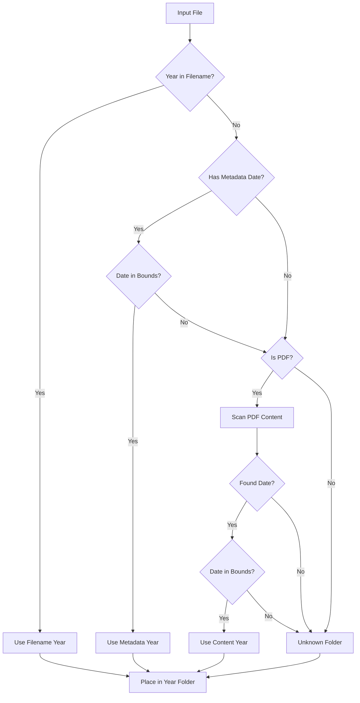

# Design Document: Enhanced Year Organization

## Overview

This design enhances the existing `organize_by_year` feature in `logic.py` to ensure ALL files are organized into year-based folders using a cascading fallback approach: filename → metadata → PDF content scanning.

The enhancement maintains backward compatibility with the existing API while adding new extraction methods that activate automatically when the filename-based approach fails.

## Architecture



## Components and Interfaces

### 1. YearExtractionResult (New Data Class)

```python
@dataclass
class YearExtractionResult:
    year: Optional[int]
    method: str  # "filename", "metadata", "content", "none"
    reason: str  # Details about extraction (pattern matched, date found, etc.)
```

### 2. extract_year_from_metadata (New Function)

```python
def extract_year_from_metadata(
    file_data: bytes,
    filename: str,
    min_year: int,
    max_year: int
) -> Tuple[Optional[int], str]:
    """
    Extract year from file metadata (modification date preferred over creation).
    
    For PDFs: Extract from PDF metadata (ModDate, CreationDate)
    For other files: Use embedded metadata if available
    
    Returns: (year or None, reason string)
    """
```

### 3. extract_year_from_pdf_content (New Function)

```python
def extract_year_from_pdf_content(
    pdf_data: bytes,
    min_year: int,
    max_year: int,
    year_policy: str,
    timeout_seconds: float = 5.0
) -> Tuple[Optional[int], str]:
    """
    Extract year from PDF content via text extraction or OCR.
    
    1. Try text extraction from first page
    2. If no dates found and OCR available, try OCR
    3. Apply year_policy if multiple dates found
    
    Returns: (year or None, reason string)
    """
```

### 4. extract_year_cascading (New Function - Main Entry Point)

```python
def extract_year_cascading(
    filename: str,
    file_data: bytes,
    min_year: int,
    max_year: int,
    year_policy: str
) -> YearExtractionResult:
    """
    Cascading year extraction: filename → metadata → content (PDF only)
    
    Returns YearExtractionResult with year, method used, and reason.
    """
```

### 5. organize_by_year (Modified)

The existing function will be updated to use `extract_year_cascading` instead of `extract_year_from_name` directly.

## Data Models

### YearExtractionResult

| Field | Type | Description |
|-------|------|-------------|
| year | Optional[int] | Extracted year (None if not found) |
| method | str | Which method succeeded: "filename", "metadata", "content", "none" |
| reason | str | Detailed reason/pattern info for debugging |

### PDF Metadata Fields Used

- `ModDate` - Modification date (preferred)
- `CreationDate` - Creation date (fallback)
- Format: `D:YYYYMMDDHHmmSS` or variations

## Correctness Properties

*A property is a characteristic or behavior that should hold true across all valid executions of a system—essentially, a formal statement about what the system should do. Properties serve as the bridge between human-readable specifications and machine-verifiable correctness guarantees.*

### Property 1: Filename Year Detection Accuracy

*For any* filename containing a valid year (1900-2099) within the configured bounds, the Year_Extractor SHALL return that year when using the filename method.

**Validates: Requirements 1.1**

### Property 2: Year Policy Consistency

*For any* filename or content containing multiple valid years, the Year_Extractor SHALL return the year matching the configured policy (first, last, or max) consistently.

**Validates: Requirements 1.2, 3.3**

### Property 3: Boundary Enforcement

*For any* detected year outside the min_year/max_year bounds, the Year_Extractor SHALL treat it as "no year found" regardless of extraction method.

**Validates: Requirements 1.3, 2.3, 3.4**

### Property 4: Fallback Chain Order

*For any* file, the Year_Extractor SHALL attempt methods in strict order (filename → metadata → content) and stop at the first successful extraction.

**Validates: Requirements 4.1, 4.2**

### Property 5: Metadata Preference

*For any* file with both creation and modification dates in metadata, the Year_Extractor SHALL prefer the modification date.

**Validates: Requirements 2.2**

### Property 6: Non-PDF Content Scanning Skip

*For any* non-PDF file, the Year_Extractor SHALL NOT attempt content scanning, falling back to unknown folder after metadata fails.

**Validates: Requirements 5.1, 5.2, 5.3**

### Property 7: Processing Resilience

*For any* batch of files where some files cause errors, the Organize_Service SHALL successfully process all non-erroring files.

**Validates: Requirements 6.3**

### Property 8: Unknown Folder Fallback

*For any* file where all extraction methods fail or return out-of-bounds years, the Organize_Service SHALL place the file in the configured unknown_folder.

**Validates: Requirements 4.3**

## Error Handling

| Error Scenario | Handling Strategy |
|----------------|-------------------|
| PDF metadata unreadable | Skip to content scanning |
| PDF content extraction fails | Skip to unknown folder |
| OCR unavailable | Use text extraction only |
| OCR/extraction timeout (>5s) | Skip to unknown folder |
| Corrupted file | Log error, place in unknown folder, continue processing |
| Invalid date format in metadata | Treat as no metadata date |

## Testing Strategy

### Unit Tests

- Test `extract_year_from_name` with various filename patterns (existing)
- Test `extract_year_from_metadata` with mock PDF metadata
- Test `extract_year_from_pdf_content` with sample PDFs containing dates
- Test `extract_year_cascading` fallback behavior
- Test boundary conditions (min_year, max_year)
- Test year_policy options (first, last, max)

### Property-Based Tests

Property-based testing will use the `hypothesis` library for Python.

Each property test should run minimum 100 iterations.

**Test Configuration:**
```python
from hypothesis import given, strategies as st, settings

@settings(max_examples=100)
```

**Property Tests to Implement:**

1. **Property 1 Test**: Generate random filenames with embedded years, verify correct extraction
2. **Property 2 Test**: Generate filenames/content with multiple years, verify policy is applied correctly
3. **Property 3 Test**: Generate years outside bounds, verify rejection
4. **Property 4 Test**: Create files with different years in filename vs metadata vs content, verify order
5. **Property 5 Test**: Create files with different creation/modification dates, verify modification preferred
6. **Property 6 Test**: Test non-PDF files, verify content scanning is never attempted
7. **Property 7 Test**: Create batches with some bad files, verify good files still process
8. **Property 8 Test**: Create files with no extractable year, verify unknown folder placement

### Integration Tests

- End-to-end test with mixed file types
- Test with real-world filename patterns
- Test API endpoint `/organize` with enhanced functionality
