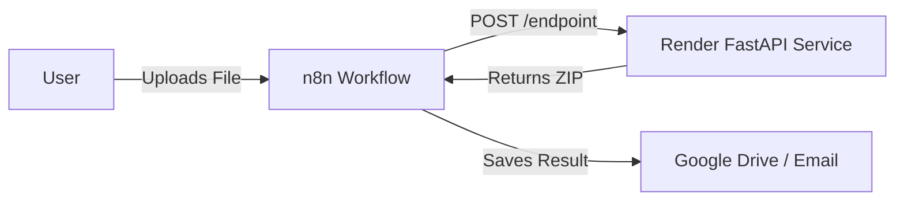

# n8n Implementation Guide: Discovery One-Stop App

This guide details how to replicate the functionality of the **Discovery One-Stop App** (Unlock, Organize, Bates Stamp, Index, Redact) using **n8n**, a robust workflow automation tool.

## Architecture Strategy

Your existing application uses powerful Python libraries (`PyMuPDF`, `Pillow`, `ReportLab`) to perform complex document processing. These operations are **not natively available** in standard n8n nodes.

Therefore, the most efficient architecture is **Orchestration**:
*   **n8n** acts as the **Manager**: It handles file triggers (Google Drive, Email, Forms), orchestrates the flow, and delivers the results.
*   **FastAPI (Render)** acts as the **Worker**: It performs the heavy PDF processing via its API endpoints.

## Prerequisites

1.  **n8n Instance**: Either [n8n Cloud](https://n8n.io) or a Self-Hosted instance.
2.  **FastAPI URL**: Your active Render deployment URL (e.g., `https://discovery-app.onrender.com`).
3.  **Test Files**: Sample PDFs to test the workflows.

---

## Workflow 1: Bates Stamping Automation

**Goal**: Automatically apply Bates stamps to any PDF dropped into a specific Google Drive folder.

### Step-by-Step Implementation

1.  **Trigger: Google Drive Trigger**
    *   **Node**: `Google Drive Trigger`
    *   **Event**: File Created
    *   **Folder**: Select a designated input folder (e.g., `Discovery/Input_Bates`).
    *   **Download**: Set "Download" to `true` (this puts the binary file data into the workflow).

2.  **Action: HTTP Request (Call API)**
    *   **Node**: `HTTP Request`
    *   **Method**: `POST`
    *   **URL**: `https://discovery-app.onrender.com/bates`
    *   **Body Content Type**: `Multipart/form-data`
    *   **Parameters**:
        *   `files`: Parameter name `files`, Value: `{{ $binary.data }}` (Select the file from the previous node).
        *   `prefix`: Text (e.g., `DEFENDANT`).
        *   `start_num`: Number (e.g., `1`).
        *   `digits`: Number (e.g., `6`).
        *   `zone`: Text (`Bottom Right (Z3)`).
        *   `margin_right`: `18`.
        *   `margin_bottom`: `18`.
    *   **Response Format**: `File` (Important! The API returns a ZIP file).
    *   **Put Response In Field**: `data` (or similar binary field name).

3.  **Action: Google Drive (Upload Result)**
    *   **Node**: `Google Drive`
    *   **Resource**: File
    *   **Operation**: Upload
    *   **File Name**: `Bates_Labeled_{{ $now.format('yyyy-MM-dd') }}.zip`
    *   **Binary Data**: Use the binary data returned from the HTTP Request.
    *   **Parent Folder**: Select an output folder (e.g., `Discovery/Output_Bates`).

---

## Workflow 2: Redaction Tool (Form-Based)

**Goal**: Allow a user to upload a file via a web form, specify keywords, and get the redacted file via email.

### Step-by-Step Implementation

1.  **Trigger: n8n Form**
    *   **Node**: `n8n Form Trigger`
    *   **Fields**:
        *   `File` (File upload).
        *   `Patterns` (Text area, "Enter words to redact, one per line").
    *   **Description**: "Upload your PDF to redact sensitive info."

2.  **Action: HTTP Request (Call API)**
    *   **Node**: `HTTP Request`
    *   **Method**: `POST`
    *   **URL**: `https://discovery-app.onrender.com/redact`
    *   **Body Content Type**: `Multipart/form-data`
    *   **Parameters**:
        *   `file`: The uploaded file from the Form Trigger.
        *   `literal_patterns`: Mapped to the `Patterns` field from the Form.
        *   `presets`: `SSN` (hardcoded or mapped from a dropdown).
    *   **Response Format**: `File`.

3.  **Action: Gmail / Email**
    *   **Node**: `Gmail` (or generic Email node)
    *   **Resource**: Message
    *   **Operation**: Send
    *   **To**: The user's email (if captured in form) or a notification address.
    *   **Subject**: `Redacted File Ready`
    *   **Attachments**: The binary file returned from the API.

---

## Workflow 3: Document Indexing

**Goal**: Convert a ZIP of labeled files into an Excel index.

### Step-by-Step Implementation

1.  **Trigger**: (Any file source, e.g., Email Attachment or Form).
2.  **Action: HTTP Request**
    *   **Method**: `POST`
    *   **URL**: `https://discovery-app.onrender.com/index`
    *   **Body Content Type**: `Multipart/form-data`
    *   **Parameters**:
        *   `file`: The input ZIP file.
        *   `party`: `Plaintiff` (or dynamic).
        *   `title_text`: `INDEX OF PRODUCTION`.
    *   **Response Format**: `File` (Excel .xlsx).
3.  **Action: Save/Forward**
    *   Save the resulting `.xlsx` file to Dropbox/Drive or email it back.

---

## Workflow 4: Organize by Year

**Goal**: Organize a chaotic dump of PDFs into year-based folders.

1.  **Trigger**: Watch Folder.
2.  **Action: HTTP Request**
    *   **Method**: `POST`
    *   **URL**: `https://discovery-app.onrender.com/organize`
    *   **Body Content Type**: `Multipart/form-data`
    *   **Parameters**:
        *   `files`: Input file(s).
    *   **Response Format**: `File` (ZIP containing folders).
3.  **Action: Compression (Optional)**
    *   **Node**: `Compression` (available in n8n) can unzip the result if you want to save the folders individually back to Google Drive (requires looping through files).
    *   *Simpler*: Just save the organized ZIP file.

---

## Key Configuration Details

### HTTP Request Node Settings
For all workflows interacting with your API, use these standard settings:
*   **Authentication**: None (unless you added API keys to your FastAPI logic).
*   **Header**: `Content-Type: multipart/form-data` is usually handled automatically by n8n when you select that Body Content Type.
*   **Binary Data**: Ensure the Property Name matches what the API expects (usually `files` or `file`).

### Handling Large Files
*   **Timeouts**: n8n HTTP Request node has a default timeout. For large redaction jobs, increase the **Timeout** setting in the node options to `300` seconds (5 minutes) or more.
*   **Memory**: Passing large binary files (100MB+) through n8n can consume memory. Standard Cloud plans handle this well, but self-hosted on small servers might struggle.

## Advanced Idea: AI Agent Router

You can use n8n's **AI Agent** node to create a "Smart Discovery Bot".

1.  **Trigger**: Chat Interface (n8n Chat).
2.  **Node: AI Agent**:
    *   **Tools**: Connect the "HTTP Request" nodes as tools for the AI.
    *   **Prompt**: "You are a legal assistant. If the user uploads a PDF and asks to stamp it, use the 'Bates Tool'. If they want to remove passwords, use the 'Unlock Tool'."

## Enhanced Integrations: Communication & Collaboration

n8n supports thousands of apps. Integrating communication tools like Slack, Microsoft Teams, and WhatsApp can transform your passive "document processor" into an active "team member".

### 1. Internal Notifications (Slack & Microsoft Teams)

**Why use it?**
*   **Instant Alerts**: Get notified immediately when a long-running job (like a 500-page Bates labeling) is finished.
*   **Error Monitoring**: If a PDF is corrupt or password-protected and fails processing, the workflow can post to a `#dev-alerts` channel so you can fix it.
*   **Approvals**: Before emailing a sensitive redacted file to a client, post it to a private channel for a manager to review.

**Example Workflow: "Manager Approval Loop"**
1.  **Redaction Workflow finishes**.
2.  **Action: Slack/Teams**: Upload the file to a `#approvals` channel with a message: *"Redacted file ready for review. Reply 'APPROVED' to send to client."*
3.  **Trigger: Slack/Teams**: Watch for new messages in `#approvals`.
4.  **Condition**: If message text contains `APPROVED`.
5.  **Action**: Email the file to the Client.

### 2. Client Communication (WhatsApp Business)

**Why use it?**
Many legal clients prefer mobile communication. You can deliver documents directly to their phone.

**Example Use Case: "Instant Delivery"**
*   **Trigger**: File organized and ready.
*   **Action: WhatsApp**: Send a template message: *"Dear Client, your documents have been organized and are attached below."*
*   **Action: WhatsApp Media**: Send the PDF/ZIP file directly in the chat.

### 3. CRM Integration (Salesforce, HubSpot, Clio)

**Why use it?**
To keep your case files synchronized with your document storage.
*   **Action**: When a file is indexed, automatically attach the Excel Index to the corresponding Matter/Case in Clio or Salesforce.
*   **Benefit**: You never have to manually drag-and-drop files between your file system and your Case Management Software.
